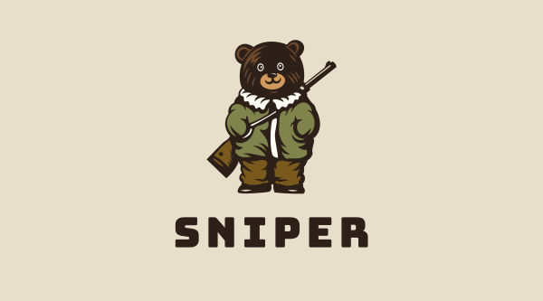
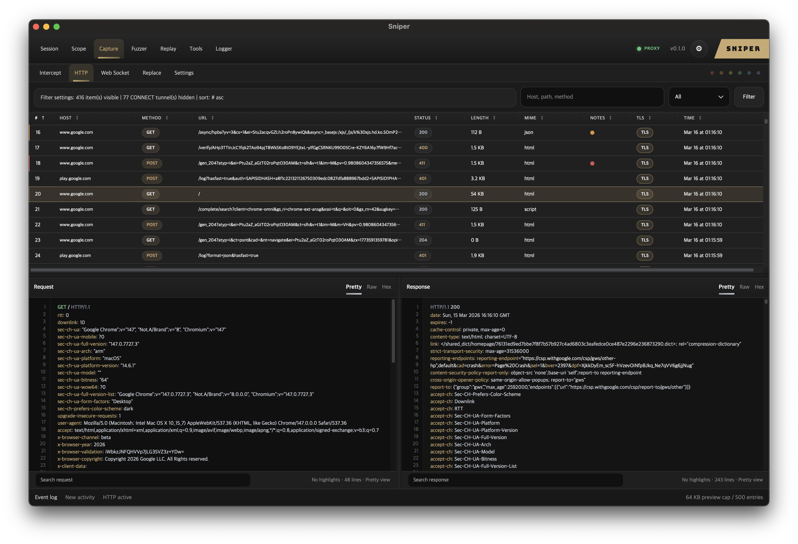

<p align="center">
  
</p>

<p align="center">
  <strong>Lightweight, fast, open-source web proxy for macOS</strong><br/>
  A modern alternative to heavy proxy platforms — built in Rust, designed for security testing.
</p>

<p align="center">
  <a href="https://github.com/sm1ee/Sniper/releases/latest"></a>
  <a href="https://github.com/sm1ee/Sniper/releases/latest"></a>
  
  
  <a href="LICENSE"></a>
</p>

<p align="center">
  
</p>

---

## What is Sniper?

Sniper is an **open-source desktop web security proxy** for macOS. It intercepts, inspects, and modifies HTTP/HTTPS traffic between your browser and the internet — the core workflow for web application security testing, bug bounty hunting, and API debugging.

If you've used Burp Suite, OWASP ZAP, or Caido, you'll feel right at home — but without the Java overhead, subscription fees, or bloated feature set. Sniper is a **native macOS app** written in Rust that starts in under a second and stays under 100 MB of RAM.

**Who it's for:** penetration testers, bug bounty hunters, security researchers, and developers who need to see what's happening on the wire.

## Install

**Download the latest `.dmg`** from [Releases](https://github.com/sm1ee/Sniper/releases/latest), open it, and drag Sniper to your Applications folder.

Or build from source:

```bash
cargo run --bin sniper-desktop
```

## Features

| Category | What you get |
|---|---|
| **Proxy** | HTTP forwarding, HTTPS MITM, persistent root CA, `https://sniper` cert portal |
| **Capture** | HTTP history, WebSocket sessions, intercept queue, match & replace rules |
| **Findings** | Passive vulnerability scanner — sensitive data, CORS, missing headers, JWT issues |
| **Replay** | Modify and resend any captured request |
| **Fuzzer** | Payload-based request testing with markers |
| **Tools** | Decode, encode, hash, JWT inspector, data transformations |
| **Sessions** | Isolated workspaces — each with its own records, scope, and state |
| **Scope** | Domain/path filtering with site map visualization |
| **Themes** | 12 themes — 7 dark + 5 light, gold-accent design language |
| **CLI** | `sniper-cli` — JSON-first automation for scripting |
| **AI Skills** | Built-in Claude & Codex skill templates using `sniper-cli` |

## Why Sniper?

| | Sniper | Burp Suite | OWASP ZAP | Caido |
|---|---|---|---|---|
| **Runtime** | Native (Rust) | JVM | JVM | Rust + Electron |
| **Startup** | < 1 sec | 10+ sec | 10+ sec | ~3 sec |
| **Memory** | ~80 MB | 500+ MB | 400+ MB | ~200 MB |
| **Price** | Free | $449/yr Pro | Free | Freemium |
| **CLI automation** | JSON-first | Limited | Limited | API |
| **AI integration** | Built-in | No | No | No |

## Quick start

1. Download and open Sniper
2. Point your browser proxy to `127.0.0.1:8080`
3. Visit `https://sniper` to download and trust the root CA
4. Start capturing

Default listeners:
- Proxy: `127.0.0.1:8080`
- UI: `127.0.0.1:23001` (headless mode)

## Core workflow

```
Session → Scope → Capture → Replay → Fuzz
                    │
          ┌─────────┼─────────┐
      Intercept    HTTP    WebSocket
                    │
               Findings (passive scan)
```

- **Session** — isolated workspaces with their own records and state
- **Scope** — define target domains/paths, auto-filter traffic
- **Capture** — inspect HTTP, intercept & modify, WebSocket frames, auto-replace
- **Findings** — passive scanner detects sensitive data leaks, CORS misconfig, missing security headers, JWT weaknesses
- **Replay** — resend with modifications, override host/port
- **Fuzzer** — insert markers, run payload lists
- **Tools** — decode/encode/hash/JWT in one place

## CLI

```bash
sniper-cli session list
sniper-cli capture http list --limit 10
sniper-cli capture http replay --id <id>
sniper-cli scope set-scope --pattern '*.example.com'
sniper-cli fuzzer run
```

Full JSON output, scriptable, AI-agent friendly.

## AI integration

```bash
sniper-cli skills install --claude   # Install Claude skill
sniper-cli skills install --codex    # Install Codex skill
sniper-cli skills install --all      # Install all
```

AI agents can drive the full workflow through CLI — capture, scope, replay, fuzz — no UI scraping needed.

## Tech stack

| Layer | Technology |
|---|---|
| Core | **Rust** — proxy, MITM, TLS, session management |
| HTTP | `hyper` + `tokio` async runtime |
| TLS | `rustls` + `rcgen` for on-the-fly certificate generation |
| UI server | `axum` serving embedded SPA |
| Frontend | Vanilla **JS** + **CSS** — zero framework, zero build step |
| Desktop shell | Native **WebView** (`wry`) |
| Packaging | macOS `.app` + `.dmg` with code signing & notarization |

## Build from source

```bash
cargo run --bin sniper-desktop   # Desktop app
cargo run --bin sniper           # Headless proxy + UI server
cargo run --bin sniper-cli       # CLI
cargo test                       # Tests
./packaging/macos/release-macos.sh   # macOS .app + .dmg
```

## Project layout

```
src/
├── proxy.rs           # Proxy core, HTTPS MITM, replay
├── api.rs             # UI/API server (axum)
├── scanner.rs         # Passive vulnerability scanner
├── session.rs         # Session registry & snapshots
├── certificate.rs     # Root CA generation & export
├── store.rs           # HTTP transaction store
├── model.rs           # Normalized data models
├── intercept.rs       # Request intercept queue
├── match_replace.rs   # Auto match & replace rules
├── fuzzer.rs          # Payload fuzzer engine
├── websocket.rs       # WebSocket capture
├── bin/
│   ├── sniper-desktop.rs   # Native desktop shell (wry)
│   └── sniper-cli.rs       # JSON-first CLI
web/                   # Frontend SPA (vanilla JS/CSS)
packaging/
├── macos/             # .app & .dmg packaging scripts
└── skills/            # Claude & Codex skill templates
```

## License

[MIT](LICENSE)
