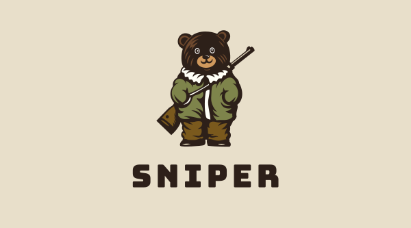
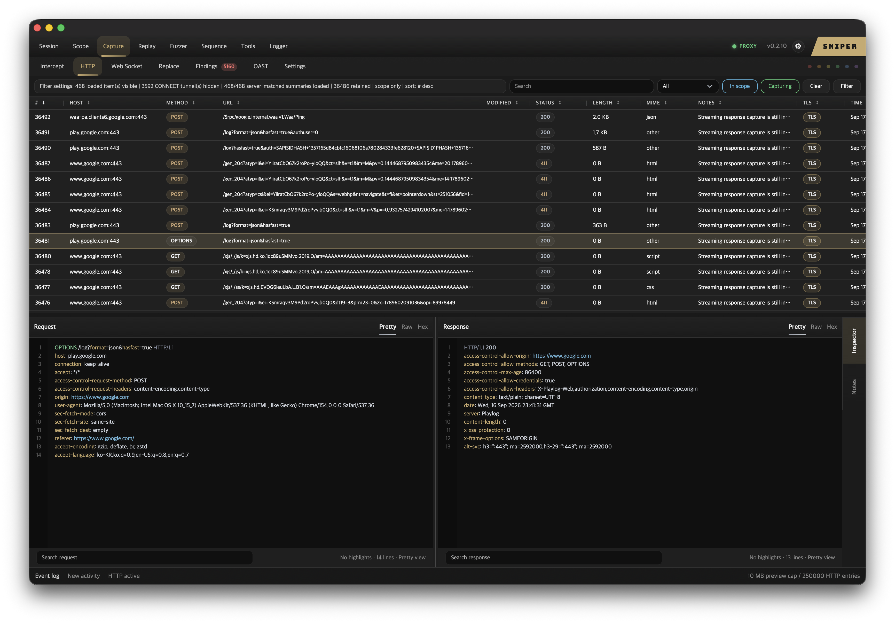
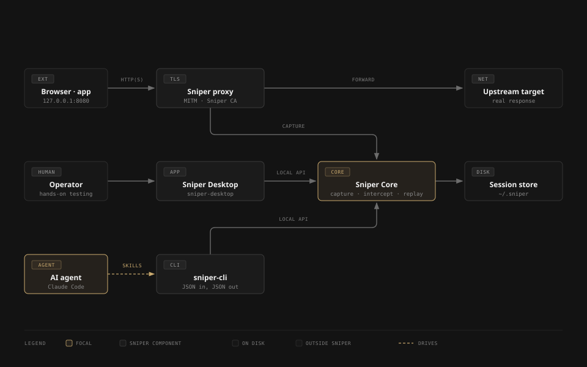

<p align="center">
  
</p>

<p align="center">
  <strong>Lightweight, fast, open-source web proxy for macOS and Windows</strong><br/>
  A modern alternative to heavy proxy platforms — built in Rust, designed for security testing.
</p>

<p align="center">
  <a href="https://github.com/sm1ee/Sniper/releases/latest"></a>
  <a href="https://github.com/sm1ee/Sniper/releases/latest"></a>
  
  
  
  <a href="LICENSE"></a>
</p>

<p align="center">
  
</p>

<p align="center">
  
</p>

---

## What is Sniper?

Sniper is an **open-source desktop web security proxy** for macOS and Windows. It intercepts, inspects, and modifies HTTP/HTTPS traffic between your browser and the internet — the core workflow for web application security testing, bug bounty hunting, and API debugging.

If you've used an intercepting proxy before, the workflow will be familiar. Sniper is a **native desktop app** written in Rust with an embedded web UI.

**Who it's for:** penetration testers, bug bounty hunters, security researchers, and developers who need to see what's happening on the wire.

## Install

### Windows

**Download the latest `-setup.exe`** from [Releases](https://github.com/sm1ee/Sniper/releases/latest) and run it.
Each installer ships with a `.sha256` beside it; check it with `Get-FileHash` before running,
since releases are not yet code-signed.

Run the Windows setup executable built by `packaging/windows/make-setup.ps1`, or extract a Windows ZIP built by `packaging/windows/make-zip.ps1` and open `sniper-desktop.exe`. Building from source requires the MSVC Rust toolchain. See [Windows setup and packaging](packaging/windows/README.md) for WebView2/runtime prerequisites, HTTPS certificates, CLI usage, and isolated testing. Windows x64 is the first port; Linux validation is still pending.

### macOS

**Install with Homebrew**, which also puts `sniper-cli` on your `PATH`:

```bash
brew install --cask sm1ee/tap/sniper
```

Or **download the latest `.dmg`** from [Releases](https://github.com/sm1ee/Sniper/releases/latest), open it, and drag Sniper to your Applications folder.
Releases are ad-hoc signed, not notarized, so on first launch macOS may ask you to
allow Sniper under System Settings ▸ Privacy & Security ▸ **Open Anyway**.

Or build from source:

```bash
cargo run --bin sniper-desktop
```

## Features

| Category | What you get |
|---|---|
| **Proxy** | HTTP forwarding, HTTPS MITM, authenticated HTTP/SOCKS5 proxy chaining, persistent root CA, `https://sniper` cert portal |
| **Browsers** | One click opens Chrome, Edge, Brave, Chromium, ego, Aside or BrowserOS neo already wired to the proxy and CA, and hands an AI agent the way to drive it |
| **Capture** | HTTP history, WebSocket sessions, intercept queue, match & replace rules |
| **Findings** | Passive vulnerability scanner — sensitive data, CORS, missing headers, JWT issues |
| **Replay** | Modify and resend any captured request |
| **Fuzzer** | Payload-based request testing with markers |
| **Tools** | Decode, encode, hash, JWT inspector, data transformations |
| **Sessions** | Isolated workspaces — each with its own records, scope, and state |
| **Scope** | Host and wildcard filtering with site map visualization |
| **Themes** | 12 themes — 7 dark + 5 light, gold-accent design language |
| **CLI** | `sniper-cli` — JSON-first automation for scripting |
| **AI Skills** | Built-in Claude & Codex skill templates using `sniper-cli` |

## Why Sniper?

- **Native.** One Rust binary with no runtime to install. It opens immediately and stays small while it runs.
- **Scriptable.** `sniper-cli` speaks JSON for the operations the UI exposes, so reviewing a capture or resending a request can be driven from a shell script.
- **Agent-ready.** Claude Code and Codex skill templates ship in the repository, so a coding agent drives the same workflow through the same CLI. OpenCode reads the Claude Code one (see the [Claude Code guide](docs/integrations/claude-code.md#opencode)).

## Quick start

1. Download and open Sniper
2. Click **Open browser** in the top bar. It opens ego, Aside or BrowserOS neo if
   you have one, otherwise an installed Chrome, Edge, Brave or Chromium, already sending its
   traffic through Sniper and trusting its certificate, so there is nothing to
   configure. The arrow beside it lists the others, and **Make default** there saves
   your choice.
   To use a browser of your own instead, point its proxy at `127.0.0.1:8080` and
   visit `https://sniper` to download and trust the root CA.
3. Start capturing

Default listeners:
- Proxy: `127.0.0.1:8080`
- UI: `127.0.0.1:23001` (headless mode)

## Wired browsers

**Open browser** starts a browser that is ready for testing: its traffic goes
through Sniper, it trusts Sniper's certificate, and it keeps a profile of its own,
apart from your everyday one. There is nothing to set up. `sniper-cli capture
browser open` does the same from a script, and with `--agent` it also hands an AI
agent what it needs to drive that browser while Sniper records every request.

| Browser | Platforms | An agent drives it through |
|---|---|---|
| Chrome, Edge, Brave, Chromium | macOS, Windows, Linux | the DevTools protocol (Playwright, chrome-devtools-mcp) |
| [ego](https://lite.ego.app/) | macOS | ego's own CLI and agent skill |
| [Aside](https://aside.com/) | macOS, Windows | Aside's CLI REPL |
| [BrowserOS neo](https://docs.browseros.com/neo/install) | macOS, Windows | its MCP server |

Sniper never installs a browser: one that is missing appears in the menu with a link
to its download page. Aside and BrowserOS neo have been checked on macOS, not yet on
Windows. The [HTTP debugging guide](docs/guides/http-debugging.md#or-open-a-browser-that-is-already-wired)
covers profiles, `--fresh` and what each driver offers.

### Remote headless UI

The headless UI can bind directly to any local address when remote access is
required:

```bash
SNIPER_DATA_DIR=/tmp/sniper-headless \
SNIPER_UI_ADDR=192.168.1.10:23001 \
  cargo run --bin sniper
```

Use `0.0.0.0:23001` instead to listen on every IPv4 interface. Any non-loopback
UI listener requires authentication for clients connecting from another host.
At startup Sniper prints a URL containing a random one-time token. An exact bind
address produces a ready-to-open URL; for a wildcard bind, replace `0.0.0.0`
with the machine's reachable address. Sniper exchanges the token for an HttpOnly
session cookie, removes the token from the address bar, and rejects any later
attempt to reuse it. Restart Sniper to issue a new token if the browser session
is lost. Same-machine clients, including `sniper-desktop` and `sniper-cli`,
remain trusted.

Sniper serves HTTP rather than TLS, so do not expose this listener directly to
an untrusted network. Use an SSH tunnel or an authenticated TLS reverse proxy
for access across one.

## Core workflow

```
Session → Scope → Capture → Replay → Fuzz
                    │
          ┌─────────┼─────────┐
      Intercept    HTTP    WebSocket
                    │
               Findings (passive scan)
```

- **Session** — isolated workspaces with their own records and state
- **Scope** — define target domains/paths, auto-filter traffic
- **Capture** — inspect HTTP, intercept & modify, WebSocket frames, auto-replace
- **Findings** — passive scanner detects sensitive data leaks, CORS misconfig, missing security headers, JWT weaknesses
- **Replay** — resend with modifications, override host/port
- **Fuzzer** — insert markers, run payload lists
- **Tools** — decode/encode/hash/JWT in one place

## Proxy chain

In **Capture → Settings**, enable **Proxy chain** and enter an upstream proxy
address (`http://127.0.0.1:8081` or `socks5h://127.0.0.1:1080`). Optional username
and password fields support HTTP Basic authentication and SOCKS5 authentication.
`socks5://` is also accepted and resolves destination names remotely, like
`socks5h://`. This configures an outbound chain; Sniper's incoming listener
continues to accept HTTP proxy requests and CONNECT, not SOCKS client requests.

The chain applies to captured HTTP/HTTPS traffic, TLS passthrough, WebSockets,
Replay, and HTTP requests sent by Fuzzer/Sequence. Chain failures never fall
back to direct connections. Existing WebSocket connections keep their current
route until reconnected.

**Connect directly to** lists hosts that skip the chain, such as a local test
service the upstream proxy cannot reach. It takes the same patterns as scope
(`*.example.com` covers the domain and its subdomains) and applies to every path
above. Hosts not on the list keep using the chain, and an empty list changes
nothing. Replay's separate connection-target override works only when its target
is on this list; otherwise edit the request destination instead.

Settings belong to each session and persist across restart. Passwords are
masked in API responses and stored in the session files on disk. Leaving the
masked value unchanged preserves the saved password; clearing it removes the
password. Environment proxy variables do not override this explicit setting.

Automation can read settings with `sniper-cli capture proxy`. To replace them,
pipe a JSON object with `enabled`, `url`, `username`, and `password` into
`sniper-cli capture proxy --stdin --yes`; `--dry-run` previews the operation
without consuming credentials. Add `bypass_hosts` (an array of patterns) to
replace the direct-connection list; leaving it out keeps the saved list. The manifest operations are `capture.proxy.get`
and `capture.proxy.configure` (the latter reads settings from stdin).

## CLI

`sniper-cli` is already bundled with the macOS app and Windows packages. The
first desktop launch offers **Add to PATH** or **Later** when registration is
available and needed. Later dismisses the prompt without changing PATH; use
**Settings ▸ Runtime ▸ Command line** whenever you want to register or retry.
Homebrew and already-registered copies skip the prompt. No external CLI or
agent skill is installed by this option.

On macOS, move Sniper.app to Applications first. Registration adds one guarded
entry to your zsh profile (`$ZDOTDIR/.zshrc`, or `~/.zshrc`) and existing
`~/.bash_profile` / `~/.bashrc` files. On Windows, registration appends the
installed or extracted app folder to the current user's PATH. Windows Setup
also has an unchecked CLI PATH option. Existing PATH entries and unrelated
commands are preserved; a conflicting `sniper-cli` is reported instead of
replaced. Open a new terminal afterwards (on Windows, restart your terminal app
if it retains the previous environment).

Keep a portable Windows folder in a stable location after registration. If you
move it, use Windows Environment Variables to replace its old **user PATH** entry
with the new folder. Automatic setup conservatively leaves an earlier ownership
record alone, so removing the old entry and retrying Settings is not a relocation
workflow. See [Windows PATH ownership and uninstall](packaging/windows/README.md#cli-and-headless-mode)
for the conservative cleanup rules.

For an explicit macOS launch-time opt-in:

```bash
SNIPER_INSTALL_CLI_PATH=1 open -a Sniper
```

```bash
sniper-cli session list
sniper-cli --output compact capture http list --limit 10
sniper-cli --output compact capture http search --value access_token
sniper-cli capture browser open --yes
sniper-cli capture http replay --id <id> --dry-run
sniper-cli capture http replay --id <id> --yes
sniper-cli scope set-scope --pattern '*.example.com' --dry-run
sniper-cli scope set-scope --pattern '*.example.com' --yes
sniper-cli fuzzer run --dry-run
sniper-cli fuzzer run --yes
```

Legacy subcommands keep their original raw JSON success output for compatibility. `call` success output is wrapped in an automation envelope; use `--output compact` for one-line JSON and read `call` results from `data`.

AI/automation callers can invoke manifest operations directly:

```bash
sniper-cli --output compact call capture.http.list --input '{"limit":20,"page":true}'
sniper-cli --output compact call replay.send --input '{"tab_id":"<tab-id>"}' --dry-run
sniper-cli --output compact call replay.send --input '{"tab_id":"<tab-id>"}' --yes
```

All side-effecting commands with `side_effect: "write"` in `sniper-cli manifest` require `--dry-run` or `--yes`.

```bash
sniper-cli manifest
sniper-cli schema input replay.send
sniper-cli examples capture.http.list
printf "%s" "$OAST_TOKEN" | sniper-cli capture oast configure --provider custom --url https://oast.example --token-stdin --yes
```

For saved-data management, the opt-in `saved.v1.*` contract provides strict schemas,
bounded session-pinned pages, and durable mutation receipts. Existing commands keep
their output format. See [saved-data contract v1](docs/integrations/saved-data-v1.md).

## AI integration

```bash
sniper-cli skills install --all --dry-run
sniper-cli skills install --all --yes
```

AI agents can drive the full workflow through CLI — capture, scope, replay, fuzz — no UI scraping needed.

- [Using Sniper from Claude Code](docs/integrations/claude-code.md)
- [Using Sniper from Codex](docs/integrations/codex.md)
- [Sniper in an agent harness](docs/guides/agent-harness.md) — which part of a harness this is, and when you do not need it

## Documentation

| Guide | Answers |
| --- | --- |
| [Debugging HTTP with Sniper](docs/guides/http-debugging.md) | What can I do with this as a plain intercepting proxy? |
| [Sniper in an agent harness](docs/guides/agent-harness.md) | Which part of my harness is this, and what goes in and out? |
| [Using Sniper from Claude Code](docs/integrations/claude-code.md) | How do I install it, confirm it works, and what can I ask for? |
| [Using Sniper from Codex](docs/integrations/codex.md) | The same, for Codex |
| [Architecture](docs/architecture.md) | Why it is built this way |
| [Contributing](AGENTS.md) | Build, test, and the invariants to not break |

## Tech stack

| Layer | Technology |
|---|---|
| Core | **Rust** — proxy, MITM, TLS, session management |
| HTTP | `hyper` + `tokio` async runtime |
| TLS | `rustls` + `rcgen` for on-the-fly certificate generation |
| UI server | `axum` serving embedded SPA |
| Frontend | Vanilla **JS** + **CSS** — zero framework, zero build step |
| Desktop shell | Native **WebView** (`wry`) |
| Packaging | macOS `.app` + `.dmg`; Windows portable `.zip` with desktop, server and CLI |

## Build from source

```bash
cargo run --bin sniper-desktop   # Desktop app
cargo run --bin sniper           # Headless proxy + UI server
cargo run --bin sniper-cli       # CLI
cargo test                       # Tests
node --test tests/*.test.cjs      # Fixture-only frontend regressions (Node.js 18+)
./packaging/macos/release-macos.sh   # macOS .app + .dmg
```

## Project layout

```
src/
├── proxy.rs           # Proxy core, HTTPS MITM, replay
├── api.rs             # UI/API server (axum)
├── scanner.rs         # Passive vulnerability scanner
├── session.rs         # Session registry & snapshots
├── certificate.rs     # Root CA generation & export
├── store.rs           # HTTP transaction store
├── model.rs           # Normalized data models
├── intercept.rs       # Request intercept queue
├── match_replace.rs   # Auto match & replace rules
├── fuzzer.rs          # Payload fuzzer engine
├── websocket.rs       # WebSocket capture
├── bin/
│   ├── sniper-desktop.rs   # Native desktop shell (wry)
│   └── sniper-cli.rs       # JSON-first CLI
web/                   # Frontend SPA (vanilla JS/CSS)
packaging/
├── macos/             # .app & .dmg packaging scripts
└── skills/            # Claude & Codex skill templates
```

## License

[MIT](LICENSE)
