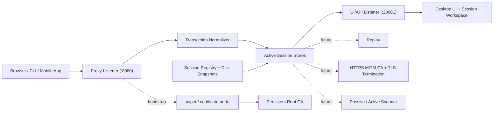
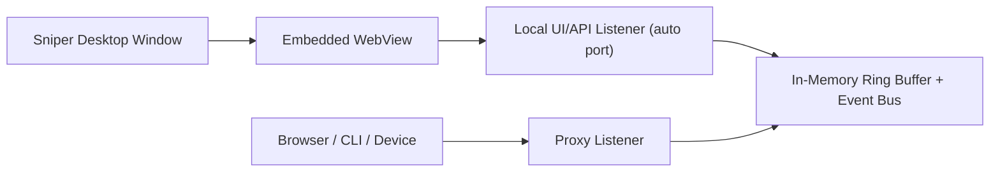
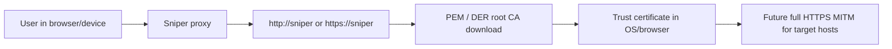

# Sniper Architecture

## Product direction

Sniper starts as a lightweight local traffic proxy with a direct capture workflow:

- traffic enters through a dedicated proxy listener
- captured transactions are normalized into a single in-memory store
- a separate UI/API listener renders records and detail panels
- a local certificate authority bootstraps trust through a dedicated `sniper` host
- a session registry isolates traffic, rules, and runtime settings per workspace
- later features plug into the same transaction model instead of coupling directly to socket logic

The first milestone intentionally focuses on:

- fast local feedback for HTTP requests
- local termination of `CONNECT` tunnels for HTTPS MITM
- an English-only capture + detail UI
- self-service root CA export from the desktop UI and `https://sniper`
- modular boundaries for MITM, replay, scanner, and extension hooks

## Why Rust first

Rust is the best fit for the current repo and environment because it gives us:

- low memory overhead and good concurrency for proxy I/O
- a single deployable binary
- strong type boundaries between capture, storage, and UI/API layers
- room to grow into TLS MITM and high-volume workflows without rewriting the core

## System layout

For desktop mode, the same core runs behind a native shell:

## Current modules

- `src/proxy.rs`
  - accepts HTTP proxy traffic
  - forwards plain HTTP requests upstream
  - terminates `CONNECT` for HTTPS MITM and replays requests upstream
  - terminates `CONNECT sniper:443` locally to serve the certificate portal
- `src/certificate.rs`
  - loads or creates a persistent local root CA
  - exposes export metadata and the TLS config for `https://sniper`
- `src/special_host.rs`
  - serves the `http://sniper` / `https://sniper` bootstrap portal
  - returns PEM and DER downloads for the local root CA
- `src/store.rs`
  - keeps a bounded ring buffer of transactions
  - emits live events to the UI
- `src/session.rs`
  - tracks session metadata and the active workspace
  - persists per-session snapshots under `data_dir/sessions/<session-id>`
  - restores runtime settings, records, websockets, rules, and fuzzer records per session
- `src/model.rs`
  - defines the shared transaction schema used by proxy, API, and future tooling
- `src/api.rs`
  - exposes record/detail APIs
  - serves the lightweight desktop UI
  - exports the root CA through API download routes
- `src/bin/sniper-desktop.rs`
  - starts the proxy and UI listeners inside one process
  - opens the desktop UI in a native window

## Bootstrap and trust flow

The current bootstrap experience is intentionally self-service:

- generate one local root CA and reuse it across restarts
- expose export buttons in the GUI
- expose the same CA through a built-in special hostname
- use that CA immediately for arbitrary-host HTTPS MITM

## Extension strategy

The next features should plug in through the transaction model and explicit middleware stages:

1. `accept`
2. `normalize`
3. `intercept`
4. `forward`
5. `post-process`
6. `persist/publish`

That lets us add:

- HTTPS MITM as a transport plugin
- replay by resending normalized requests
- passive scanner as a post-processing stage
- project/workspace persistence behind a storage trait

## Known tradeoffs in milestone 1

- request and response bodies are fully collected before forwarding completes
- only preview bytes are persisted in-memory for inspection
- HTTPS MITM currently speaks HTTP/1.1 to the client-facing side
- session persistence currently writes full JSON snapshots instead of an append-only store
- WebSocket records and richer request-hold controls are still evolving

These tradeoffs keep the first implementation simple while preserving the right boundaries for the next iteration.
